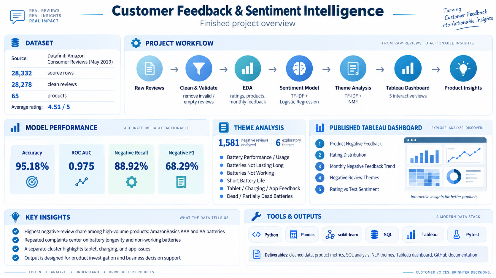

# Customer Feedback & Sentiment Intelligence

Product analytics project using Amazon consumer reviews to identify recurring customer pain points, compare written feedback with star ratings, and surface product-level feedback patterns.

## What This Project Does

A quick visual summary of the completed project, including the dataset, workflow, model performance, theme analysis, Tableau dashboard, key insights, and tools used.



## Business questions

- Which products receive the most negative feedback?
- What complaint themes repeat across negative reviews?
- Where does written sentiment disagree with star ratings?
- How does feedback change over time?
- Which product areas deserve deeper investigation?

## Dataset

The analysis uses the **Datafiniti Amazon Consumer Reviews of Amazon Products — May 2019** file as the primary source.

After validation and cleaning:

- **28,278 reviews**
- **65 product IDs**
- **4.51 / 5 average rating**
- **90.17%** of reviews are 4-5 stars
- **5.59%** are 1-2 stars

The raw dataset is not stored in this repository. Place it at:

```text
data/raw/amazon_reviews.csv
```

See `reports/data_profile.md` for the dataset-selection and overlap checks.

## Approach

1. Standardize Datafiniti product and review fields.
2. Remove invalid, empty, and duplicate review records.
3. Treat 1-2 stars as negative, 3 stars as neutral, and 4-5 stars as positive.
4. Train a TF-IDF + logistic-regression text classifier using non-neutral rating polarity.
5. Evaluate the classifier on a stratified 20% holdout.
6. Flag only high-confidence opposite-polarity rating/text disagreements.
7. Use TF-IDF + NMF on 1-2-star reviews to explore recurring pain-point themes.
8. Build product-level and monthly feedback metrics.
9. Export interpretable tables for SQL and Tableau.

## Model validation

The text model produced:

- **95.18% accuracy**
- **0.975 ROC AUC**
- **88.92% negative-class recall**
- **68.29% negative-class F1**

Because positive reviews dominate the dataset, the project reports class-specific metrics rather than relying on accuracy alone.

## Initial findings

Among products with at least 100 reviews:

- AmazonBasics AAA Performance Alkaline Batteries: **8,336 reviews**, **9.63% negative-rating share**
- AmazonBasics AA Performance Alkaline Batteries: **3,727 reviews**, **9.20% negative-rating share**

Exploratory negative-review topics repeatedly surface battery longevity, batteries that arrive or become non-working, and a separate tablet/app/charging cluster.

These patterns are treated as investigation priorities rather than causal conclusions. See `reports/initial_findings.md` and `reports/business_recommendations.md`.

## Live Tableau dashboard

Explore the published dashboard:

https://public.tableau.com/app/profile/sri.popuri/viz/CustomerFeedbackSentimentIntelligence/Dashboard1


The dashboard includes:

- Product negative-feedback ranking
- Rating distribution
- Monthly negative-feedback trend
- Negative-review theme analysis
- Rating vs. text-sentiment comparison

## Project structure

```text
src/
  analysis.py
  data_loader.py
  product_metrics.py
  sentiment.py
  text_processing.py
  theme_analysis.py
sql/
  review_metrics.sql
reports/
  analysis_notes.md
  business_recommendations.md
  data_profile.md
  initial_findings.md
  qa_checklist.md
  theme_guide.md
tableau/
  DASHBOARD_SPEC.md
  README.md
tests/
  test_core.py
```

## Run locally

```bash
pip install -r requirements.txt
python -m src.analysis
python -m pytest -q
```

The pipeline creates Tableau-ready outputs under `data/processed/`.

## Verification

The end-to-end pipeline was run against the primary dataset and generated all planned analysis outputs. The current automated test suite passes **5 tests**.

## Tools

Python, Pandas, scikit-learn, SQL/DuckDB, Tableau Public, and Pytest.

## Limitations

The data is a historical public review snapshot. Review volume differs substantially across products, ratings are strongly skewed positive, and topic models summarize language patterns rather than causes. Representative reviews should be examined before converting an exploratory topic into a product decision.
